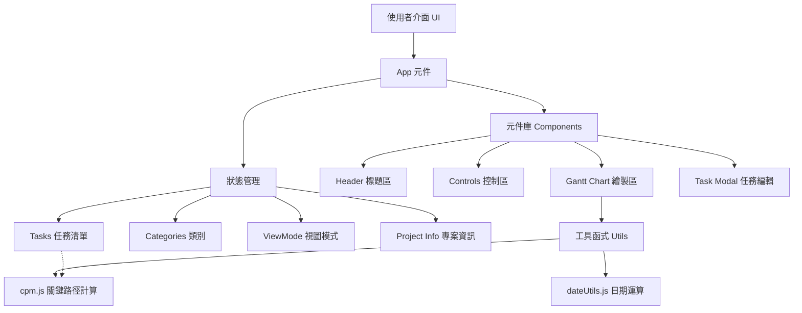

# Klin Gantt Chart - 專業專案甘特圖工具 📊

這是一個基於 React 打造的輕量級、功能強大的專業甘特圖工具。專為專案管理者設計，提供直覺的介面與豐富的導出功能。

## 🏗️ 系統架構 (Architecture)



## ✨ 強大功能清單 (Comprehensive Feature List)

### 1. 📅 多尺度時間視圖 (Dynamic View Modes)
- **日、週、月、年** 四種視圖秒切換，適應短期衝刺或長期規劃。
- **精確比例尺系統**：自動計算不同月份天數比例，確保長度與跨度精確對齊。
- **智能標籤**：根據視圖模式自動切換日期顯示格式（如週視圖顯示 W48，月視圖顯示年份月份）。

### 2. ✏️ 直覺編輯體驗 (Interactive UI)
- **直接編輯標題**：點擊畫面上方標題與副標題即可直接修改，並同步更新瀏覽器標籤。
- **任務彈窗編輯**：輕鬆新增、編輯或刪除任務，支援進度百分比設定。
- **里程碑設定**：支援建立 0 天長度的里程碑任務。
- **組件同步捲動**：頂部日期列與下方任務區域水平滾動完美同步。
- **今天指示線**：紅色垂直線與「今天」標籤，隨時掌握目前進度。

### 3. 🎨 類別與樣式管理
- **自定義類別**：可自由新增類別並為其分配代表顏色。
- **顏色連動**：任務條自動套用所屬類別顏色，一目了然。

### 4. 🧮 進階專案管理
- **要徑法 (CPM) 支援**：自動計算任務相依性，找出專案的關鍵路徑。
- **寬裕時間 (Slack) 計算**：顯示每個任務可容許的延遲天數。

### 5. 📤 檔案存取與分享 (Import/Export)
- **JSON 專案檔**：支援將整個專案導出為 JSON，方便備份或分享給他人再次載入。
- **圖片匯出**：一鍵將甘特圖截圖為高品質 PNG 圖片。
- **自定義浮水印**：截圖支援加入浮水印，可自定義文字、顏色、透明度、大小及旋轉角度。

## 🛠️ 技術棧
- **框架**：React 18
- **樣式**：Tailwind CSS (Vanilla CSS 輔助)
- **圖示**：Lucide React
- **引擎**：Vite
- **截圖**：html2canvas

## 🚀 本地開發與環境設置指南 (Setup Guide)

1. **環境要求**
   - Node.js (建議版本 18.x 或以上)
   - npm 或 yarn 或是 pnpm

2. **複製專案**
   ```bash
   git clone https://github.com/klin1976/klin-gantt-chart.git
   cd klin-gantt-chart
   ```

3. **安裝依賴套件**
   ```bash
   npm install
   # 或使用 yarn install
   ```

4. **啟動開發伺服器**
   ```bash
   npm run dev
   ```
   伺服器啟動後，開啟瀏覽器並進入 `http://localhost:5173`。

5. **建置生產版本**
   ```bash
   npm run build
   ```
   建置後的靜態檔案將會產生在 `dist` 目錄中。

6. **預覽生產版本**
   ```bash
   npm run preview
   ```

## 📄 授權
Licensed under the MIT License.
